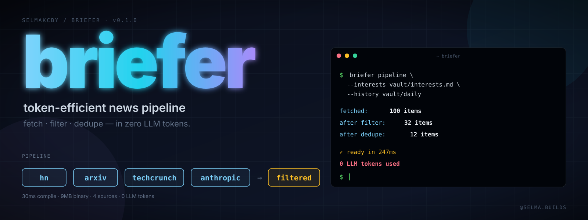

<p align="center">
  
</p>

# briefer

[](https://pkg.go.dev/github.com/selmakcby/briefer)
[](go.mod)
[](#license)

A token-efficient morning briefing pipeline. Built for [Claude Code routines](https://code.claude.com/docs/en/routines), but works as a standalone CLI.

The premise: in a routine that fetches news, filters it, deduplicates, then summarizes — only the summarization should burn LLM tokens. Everything else is deterministic work that a small Go binary does in ~300 ms.

```console
$ briefer pipeline --interests vault/interests.md --history vault/daily
fetched: 70 items
after max-age (24h0m0s): 39 items
after filter: 4 items
after dedupe: 3 items
{
  "items": [
    {
      "title": "Pentagon releases UFO files on new website",
      "url": "https://techcrunch.com/2026/05/08/pentagon-releases-ufo-files...",
      "source": "techcrunch",
      "published_at": "2026-05-08T15:56:36Z",
      "snippet": "..."
    }
  ]
}
```

Stderr is the live progress trace (4 stages, item count after each). Stdout is structured JSON ready to pipe into an LLM summarizer agent. Full run completes in ~300 ms with zero LLM tokens spent.

## What it does

```
sources           | filter           | dedupe            | LLM (later)
------------------|------------------|-------------------|------------------
hn                | interests.md     | vault/daily/*.md  | summarize
arxiv             | --skip negatives | last N days       | extract todos
techcrunch        |                  |                   | post to Discord
anthropic         |                  |                   |
```

Stages 1–3 run in `briefer`. Only the LLM stage talks to Claude.

## Why

A naive routine implements the four fetchers as Haiku agents. Each agent burns ~14 K tokens just to call `WebFetch` and parse JSON. Across four sources plus filter and dedupe agents, the deterministic parts of the pipeline use ~85 K tokens before the model has done a single thought.

Replacing those stages with a Go CLI brings that to ~0 tokens. The summarizer agent still runs (that's the actual LLM work), but it gets clean structured input instead of having to drive the fetch.

Approximate savings on a 5-source pipeline: **~70% fewer tokens per run** with the same final output.

## Why a Go CLI (and not an MCP server, or a Python script)

| Approach | Why not |
|---|---|
| **MCP server** | Cloud routines don't always have an MCP runtime configured, and adding one for a job that's a 200ms HTTP call + JSON parse is overkill. MCP shines when the LLM needs to *interact* with a tool turn-by-turn; here the LLM just consumes the tool's final output. |
| **Python script** | Works, but cloud routine envs ship a different Python version and toolchain than your laptop, and `pip install` against an arbitrary feedparser/dateutil pin gets brittle. A single static Go binary has no runtime deps — copy and run. |
| **Bash + curl + jq** | Fine for one source. Falls apart at four sources in parallel with timeouts, error fall-through, and structured output. The Go version is shorter than the equivalent shell would be. |
| **A new LLM agent** | This is the failure mode the project was built to fix. Don't pay tokens to do `WebFetch` + `json.parse`. |

The CLI form has the additional property that it's debuggable from a normal terminal — you can `briefer fetch hn | jq` and watch what it sees, instead of reading agent transcripts.

## Install

### Local terminal (Go installed)

```bash
go install github.com/selmakcby/briefer/cmd/briefer@latest
# binary lands in $(go env GOPATH)/bin/briefer — make sure that's on your PATH
```

Or build from source:

```bash
git clone https://github.com/selmakcby/briefer
cd briefer
go build -o briefer ./cmd/briefer
./briefer pipeline --interests vault/interests.md --history vault/daily
```

### Claude Code cloud routine (no Go)

Cloud routines run in a sandboxed Linux env with **no Go toolchain**, so `go install` won't work there. Instead, cross-compile locally and ship the binaries inside your routine repo:

```bash
# from a clone of this repo
GOOS=linux GOARCH=amd64 go build -o bin/briefer-linux-amd64 ./cmd/briefer
GOOS=linux GOARCH=arm64 go build -o bin/briefer-linux-arm64 ./cmd/briefer
```

Copy `bin/briefer-linux-{amd64,arm64}` into your routine's git repo (anywhere — `bin/` is a clean default). Commit, push. The routine prompt then picks the right binary at runtime based on `uname -m` — see "Routine integration" below for the snippet.

A complete copy-pasteable example lives under [`examples/morning-routine-prompt.md`](./examples/morning-routine-prompt.md) — a working Claude Code routine prompt that bundles these binaries, calls `briefer pipeline`, hands the survivors to two LLM agents (`summarizer`, `todo-maker`), and posts to Discord.

## Usage

### Single source

```bash
briefer fetch hn          # → JSON on stdout
briefer fetch arxiv
briefer fetch techcrunch
briefer fetch anthropic
```

### All sources, in parallel

```bash
briefer fetch-all > items.json
```

### Filter against your interests

`vault/interests.md` is a markdown bullet list:

```markdown
## Core focus

- Claude (Anthropic) — releases, model updates, Claude Code, MCP, Skills, Agents
- AI agents — multi-agent systems, agent frameworks
- Model Context Protocol (MCP)

## Skip

- Crypto, web3, NFT
- AI hype pieces
```

Each bullet is exploded into individual keywords (`Claude`, `Anthropic`, `Claude Code`, `MCP`, …), and an item is kept if its title or snippet contains any positive keyword and no negative keyword.

```bash
briefer filter --interests vault/interests.md < items.json > filtered.json
```

### Dedupe against past briefings

```bash
briefer dedupe --history vault/daily --lookback 7 < filtered.json > new.json
```

The deduper scans the most recent N daily files and drops any item whose URL or title appears in them.

### Full pipeline

The three deterministic stages combined:

```bash
briefer pipeline \
  --interests vault/interests.md \
  --history vault/daily \
  > /tmp/survivors.json
```

This is what you call from a Claude Code routine. The output is ready for an LLM summarizer to read.

## Routine integration

Replace the deterministic stages of your routine prompt with a single shell call. The fetcher / filterer / dedupe LLM agents can be deleted entirely — `briefer` does it in zero tokens. The remaining LLM work (summarize, extract todos) keeps its agents. Permissions stay tight: `briefer` only needs `Bash`.

### Step 1 — pick the binary at runtime

Bundle both Linux binaries in `bin/` (see "Install → Claude Code cloud routine" above), then in the routine prompt:

```bash
ARCH=$(uname -m)
case "$ARCH" in
  x86_64)  BRIEFER=./bin/briefer-linux-amd64 ;;
  aarch64) BRIEFER=./bin/briefer-linux-arm64 ;;
  *) echo "unsupported arch: $ARCH" >&2; exit 1 ;;
esac
chmod +x "$BRIEFER"
```

### Step 2 — run the pipeline

```bash
$BRIEFER pipeline \
  --interests vault/interests.md \
  --history vault/daily \
  --max-age 24h \
  > /tmp/items.json
```

`--max-age 24h` is the default; pass a different duration (e.g. `12h`, `48h`) to widen or narrow the window.

### Step 3 — hand off to the LLM

Read `/tmp/items.json`, pass the `items` array to your summarizer agent. The summarizer no longer drives the fetch — it just reads structured input and writes a briefing.

### Step 4 — network allowlist

Cloud routines run with a network allowlist. The default "Trusted" preset blocks some sources. Use **Custom network** in the routine's environment settings and allow:

```
news.ycombinator.com    hn.algolia.com
export.arxiv.org        arxiv.org
techcrunch.com
www.anthropic.com
discord.com             github.com
```

For a fully working routine prompt you can copy and adapt, see [`sabah-asistani/routine-prompt.md`](https://github.com/selmakcby/sabah-asistani/blob/main/routine-prompt.md).

## Sources

| Source | Endpoint | Format |
|---|---|---|
| `hn` | `https://hn.algolia.com/api/v1/search?tags=front_page` | JSON |
| `arxiv` | `https://export.arxiv.org/api/query?search_query=cat:cs.AI` | Atom |
| `techcrunch` | `https://techcrunch.com/feed/` | RSS 2.0 |
| `anthropic` | `https://www.anthropic.com/sitemap.xml` (no public RSS) | Sitemap XML |

To add a new source, drop a file in `internal/source/` that registers itself in `init()` and implements the two-method `Source` interface. See `internal/source/hn.go` for the simplest example.

## Output shape

Every command emits the same JSON envelope:

```json
{
  "items": [
    {
      "title": "Teaching Claude Why",
      "url": "https://www.anthropic.com/research/teaching-claude-why",
      "source": "anthropic",
      "published_at": "2026-05-08T00:00:00Z",
      "snippet": "...",
      "score": 0
    }
  ]
}
```

Predictable, pipeable, machine-readable.

## Examples

A complete morning routine — interests file, agent definitions, routine prompt — lives under [`examples/`](./examples/):

- [`examples/interests.md`](./examples/interests.md) — sample keyword list
- [`examples/morning-routine-prompt.md`](./examples/morning-routine-prompt.md) — full Claude Code routine prompt that wires briefer to two LLM agents (summarizer, todo-maker) and a Discord webhook

## Tests

```bash
go test ./...
```

Filter package has unit tests for keyword expansion, want/skip parsing, and the apply rules. Source-side fetchers are not unit-tested (they're thin wrappers around real HTTP — covered by manual `briefer fetch <name>` runs).

## FAQ

**A source fails — does the whole pipeline die?**
No. `fetch-all` runs the four sources in parallel and a single source's failure is logged to stderr but doesn't abort the run. You'll see fewer items but a valid JSON response.

**What happens on a quiet news day (zero survivors)?**
`pipeline` prints `{"items":[]}` and exits 0. The routine prompt should detect this and have the summarizer return `NO_BRIEFING_TODAY` instead of trying to invent stories. See `examples/morning-routine-prompt.md` for the gate.

**How do I add a new source?**
Drop a file in `internal/source/` that implements the two-method `Source` interface and registers itself in `init()`. `internal/source/hn.go` is the simplest reference. Re-build the binary and you're done.

**Rate limits?**
Each source has its own conventions. Hacker News (Algolia) has no aggressive limits, arXiv asks for a 3-second courtesy delay between calls (we make one call per run), TechCrunch's RSS endpoint is uncached but lightweight, Anthropic's sitemap → article fetches are bounded to 12 concurrent + capped at 25 articles per run. If you fork to add a high-volume source, add throttling in your fetcher.

**Why is `--max-age` 24h by default?**
Morning briefings are about *yesterday's news*. Items older than 24h have either already been seen (dedupe would catch them) or are no longer "morning"-relevant. Override with `--max-age 12h` for tighter windows or `--max-age 72h` over a long weekend.

**Can I run this without a Claude Code routine?**
Yes — it's a standalone CLI. `briefer pipeline > items.json` gives you the same JSON output you'd hand to any LLM (Anthropic API, OpenAI, local model). The "routine integration" section is one specific deployment path; the CLI doesn't depend on it.

**Anthropic source uses a sitemap — why not RSS?**
Anthropic doesn't publish a public RSS feed for /news, and the sitemap's `lastmod` is last-edit, not publish date. The fetcher resolves real `publishedOn` from each article's embedded Next.js JSON. Slow-ish (~7-10s for 12 parallel fetches) but accurate — the alternative was stale 2024 articles bubbling up because someone edited the page.

## License

MIT.

## Related

Built as the V7 follow-up to [@selma.builds](https://www.youtube.com/@selma.builds)' V6 video on the morning-assistant routine. The V6 system used five LLM agents for what `briefer` does in zero — that's the lesson.

The full reference deployment lives at [selmakcby/sabah-asistani](https://github.com/selmakcby/sabah-asistani) — same routine prompt, agent files, vault layout. (Public release pending; the routine prompt is mirrored under [`examples/`](./examples/) here.)
